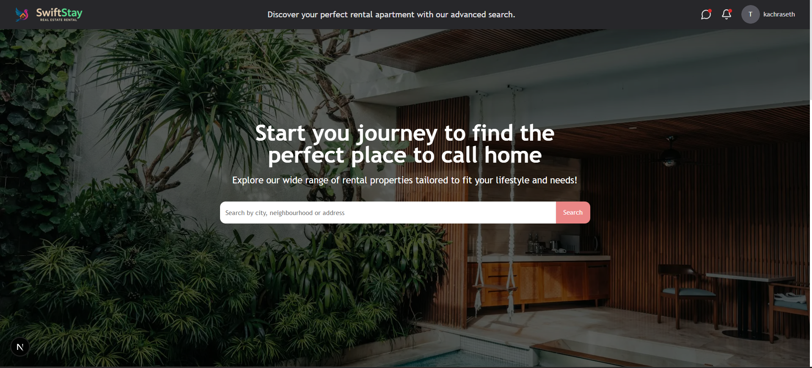
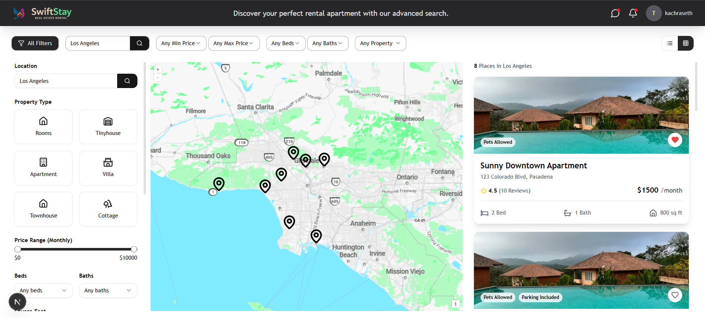
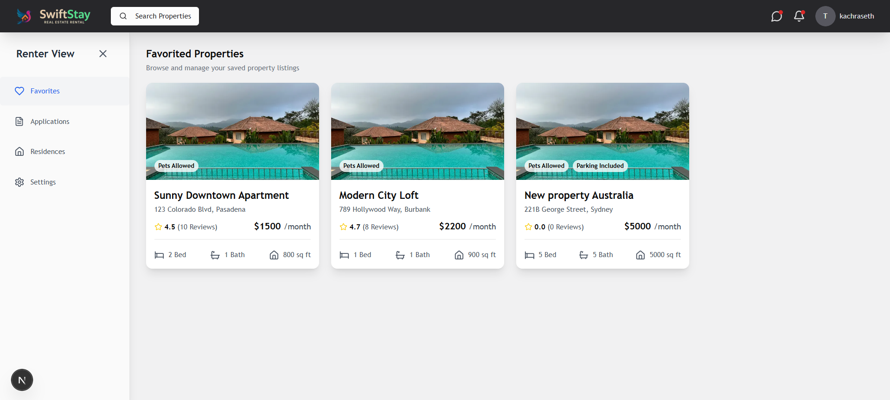
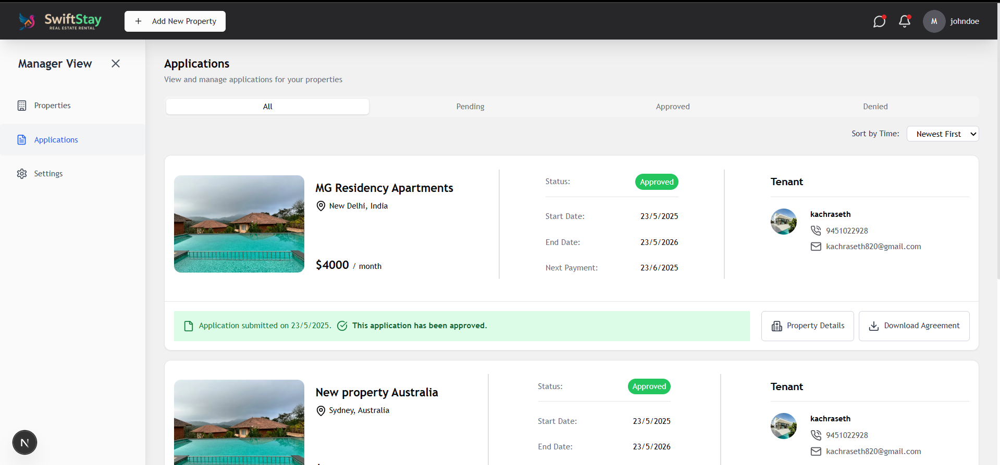
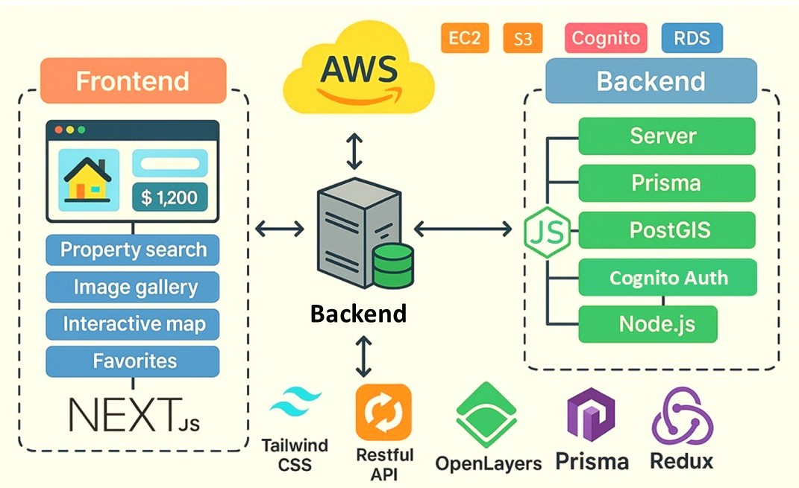
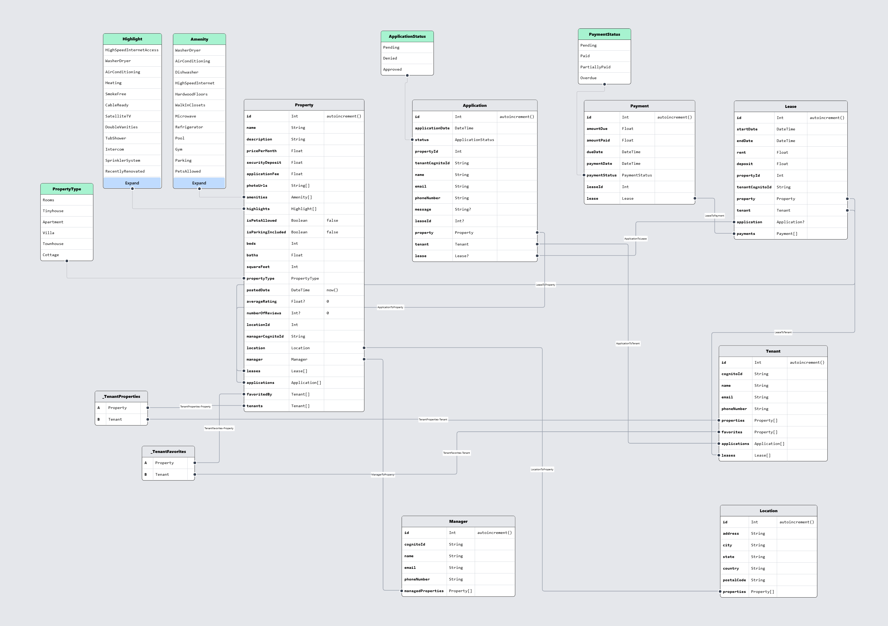

# 🏡 SwiftStay - Modern Real Estate Rental Platform

<div align="center">
  


</div>

SwiftStay is a modern real estate rental platform built with Node.js, AWS (EC2, S3, Cognito, RDS), Next.js, PostgreSQL with PostGIS, TailwindCSS, OpenLayers, MapTiler, Zod, Redux Toolkit Query, and Prisma ORM.

## 🌍 Live Demo

client-> https://swiftstay-rental.vercel.app [HOSTED ON VERCEL]<br/>
server-> https://real-estate-rental-nw85.onrender.com [HOSTED ON RENDER]

## 📸 Screenshots

<div align="center">
  
  <p><em>Beautiful Homepage search functionality</em></p>
  
  <br />
  
  
  <p><em>Interactive map view with property markers and filtering options</em></p>
  
  <br />
  
  
  <p><em>Property tenant dashboard for favourites and applied applications</em></p>
  
  <br />
  
  
  <p><em>Property manager dashboard for listing management and application review</em></p>
</div>

## 🔍 System Architecture

<div align="center">
  
  <p><em>High-level architecture diagram showing the interaction between frontend, backend, and AWS services</em></p>
</div>

## 👥 User Roles

### 🧑 Tenant

- Browse property listings with advanced filtering
- View listings on an interactive map
- Apply for rental properties
- Save listings as favorites
- Track application status
- _(Future)_ Make payments through LemonSqueezy

### 🧑‍💼 Manager

- Create and manage property listings
- Review and approve rental applications
- Track property performance
- _(Future)_ Generate contracts and payment cycles

## 🚀 Key Features

### Core Functionality

- 🔐 Secure login/signup using AWS Cognito
- 🗺️ Interactive property listing map using OpenLayers Map
- 📦 Property images stored on AWS S3
- 📍 Location-based filtering using PostGIS
- 🧾 Strong form validation via Zod
- 🧠 Efficient state management via Redux Toolkit Query

### Advanced Filtering

Filter properties by:

- 💰 Price range (min/max)
- 🛏️ Number of bedrooms & bathrooms
- 🏠 Property type
- 📏 Square footage (min/max)
- 🛁 Amenities
- 📅 Availability date
- 📌 Geographic location
- ⭐ Favorites

### Current Functionality

- Properties can be rented for 1 year (hardcoded duration - future: flexible)
- Tenants can apply to listings and track application status
- Managers can approve or reject tenant applications
- Interactive map view shows all property listings
- Payment functionality via "amount" field (future: LemonSqueezy integration)
- Secure file uploads for property images to AWS S3
- User authentication via AWS Cognito

## 🛠️ Technology Stack

| Layer                | Technologies                                                                                        |
| -------------------- | --------------------------------------------------------------------------------------------------- |
| Frontend             | Next.js, TailwindCSS, Redux Toolkit Query, Shadcn UI Components, React Hook Form,                   |
| Backend              | Node.js, Zod (validation), Prisma ORM, RESTful API architecture                                     |
| Database             | PostgreSQL, PostGIS (for geospatial queries), AWS RDS                                               |
| Cloud Infrastructure | AWS Cognito (Authentication), AWS S3 (File Storage), AWS EC2 (Frontend/Backend), AWS RDS (Database) |
| Maps                 | OpenLayers, Nominatim, MapTiler for Map UI                                                          |
| Future Payments      | LemonSqueezy (Planned)                                                                              |

## 🗄️ Database Schema

<div align="center">
  
  <p><em>PostgreSQL database schema ER Diagram with PostGIS extensions for geospatial data</em></p>
</div>

## 🛣️ Roadmap

| Feature                            | Status     |
| ---------------------------------- | ---------- |
| LemonSqueezy Payment Integration   | 🔜 Planned |
| Dynamic Contract Duration          | 🔜 Planned |
| Admin Dashboard                    | 🔜 Planned |
| Lease PDF Generation               | 🔜 Planned |
| Real-Time Notifications            | 🔜 Planned |
| Ratings and Reviews                | 🔜 Planned |
| Messaging between Tenants/Managers | 🔜 Planned |

## 📦 Getting Started 
### Installation

#### 1. Clone the repository

```bash
git clone https://github.com/harshit2004h/Real-Estate-Rental
cd Real-Estate-Rental
```

#### 2. Set up the server

```bash
# Navigate to the server directory
cd server

# Install dependencies
npm install

# Copy environment file and configure it
cp .env.server .env

# Set up your database credentials and other environment variables in the .env file
# Then run database migrations
npx prisma migrate dev --name init

# Start the server in development mode
npm run dev
```

#### 3. Set up the client

```bash
# Open a new terminal window
# Navigate to the client directory from the project root
cd client

# Install dependencies
npm install

# Copy environment file and configure it
cp .env.client .env

# Start the client development server
npm run dev
```

## 📚 Useful Resources & Documentation

### Frontend

- [OpenLayers](https://openlayers.org/)
- [Map Tiler](https://www.maptiler.com/)
- [Nominatim](https://nominatim.org/)
- [Shadcn UI Components](https://ui.shadcn.com/)
- [React Hook Form](https://react-hook-form.com/)
- [Zod Validation Library](https://zod.dev/)
- [Redux Toolkit](https://redux-toolkit.js.org/)
- [Redux Toolkit Query](https://redux-toolkit.js.org/rtk-query/overview)

### Backend & Infrastructure

- [PostgreSQL](https://www.postgresql.org/docs/)
- [PostGIS](https://postgis.net/documentation/)
- [PgAdmin](https://www.pgadmin.org/docs/)
- [Prisma ORM](https://www.prisma.io/docs/)
- [AWS Cognito](https://docs.aws.amazon.com/cognito/)
- [AWS Amplify Cognito React Docs](https://docs.amplify.aws/lib/auth/getting-started/q/platform/js/)

## 🧑‍💻 Contributing

Contributions are welcome!

1. Fork the repository
2. Create your feature branch: `git checkout -b feature/your-feature`
3. Commit your changes: `git commit -m 'Add feature'`
4. Push to the branch: `git push origin feature/your-feature`
5. Open a pull request 🚀

## 📄 License

This project is licensed under the [MIT License](LICENSE.md).

## 👤 Author

**Harshit Srivastava**

- Email: hsriv04@gmail.com
- LinkedIn: [linkedin.com/in/harshit2004h](https://www.linkedin.com/in/harshit2004h)

✨ Made with ❤️ by the Harshit
